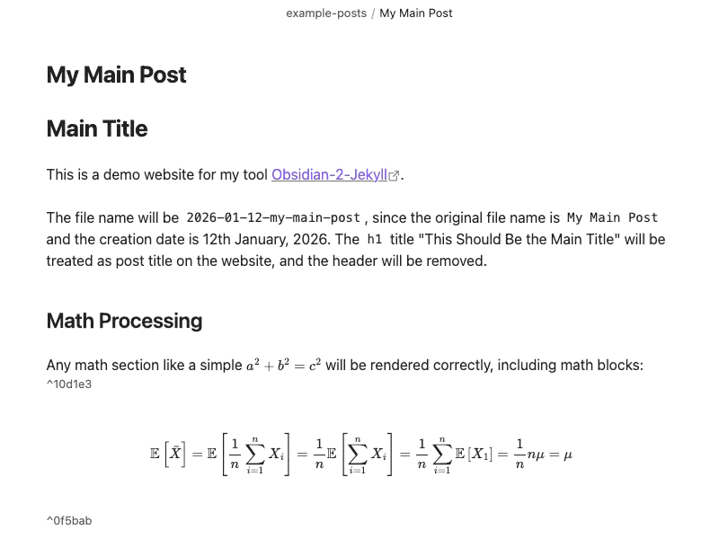
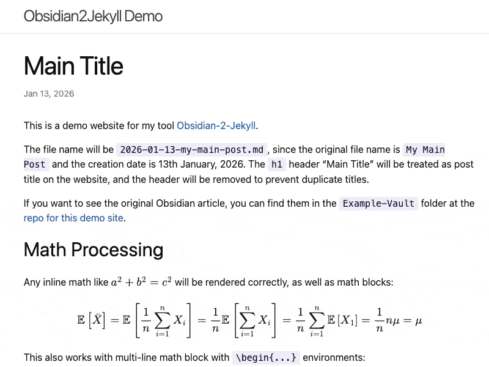

# Obsidian2Jekyll

[](https://opensource.org/licenses/MIT)


A theme-agnostic tool that makes your Obsidian articles Jekyll-ready.

This is a tool build with python that scans your obsidian vault, formats your articles to make them compatible with Jekyll's requirements, and saves them to your Jekyll project folder, waiting to be published, so you can keep your articles clean, while Jekyll gets its preferred flavor.

## Features

- Auto-generates all the essentials for the frontmatter.
- Converts your `h1` header to your post title.
- Copies used images to Jekyll assets folder and update `![[img]]` links.
- Converts `[[Wikilinks]]` to standard Markdown links.
- `$Math$` / `Code` / `> [!Callout]` / `[[#^Internal-link]]` support.
- Syncs to your vault; removed posts get deleted on you Jekyll site too.
- Your original Obsidian article remains intact, the way you want it to be.

## Live Demo

| Original Obsidian Article | Processed Jekyll Site |
| :---: | :---: |
|  |  |

  <div align="center">
    <p><a href="https://kckhchen.com/obsidian-2-jekyll-demo/my-main-post/"><b>Read the Demo Blog Post</b></a></p>
  </div>

## Quick Start

### Prerequisites

- Python 3.8+
- The `python-frontmatter` package. You can install it with:

```
pip install python-frontmatter
```

### Run the Tool

#### 1. Clone this repo:

```bash
git clone https://github.com/kckhchen/obsidian-2-jekyll.git
cd obsidian-2-jekyll
```

#### 2. Configure `config.py` to locate your vault:


| Variable      | Description                  | Example                     |
| ------------- | ---------------------------- | --------------------------- |
| `VAULT_DIR`   | Path to your Obsidian Vault  | `/Users/me/Obsidian-Vault`  |
| `JEKYLL_DIR`  | Your Jekyll project folder   | `/Users/me/Jekyll-Website`  |


```python
# config.py
VAULT_DIR = "/Users/me/Obsidian-Vault"      # Path to Your Vault Folder
JEKYLL_DIR = "/Users/me/Jekyll-Website"     # Path to Your Jekyll Folder
```

#### 3. Setup Your Posts

Add `share: true` to your post's frontmatter ([Obsidian Properties](https://help.obsidian.md/properties)). You can use a [checkbox](https://help.obsidian.md/properties#Checkbox) or [plain text](https://help.obsidian.md/properties#Text). You can also add other settings (e.g. `date`, `slug`) to the frontmatter at this stage, although they are not strictly required.

Note that the tool adds `title`, `layout`, and `math` (based on settings) to the frontmatter for you, and grabs the creation date of your post as the `date` if you do not set one, so you don't have to configure these unless you wish to override the settings.

```
---
share: true
---

# My Post Title
```
Only posts with `share: true` will be processed.

#### 4. Run the command

```bash
# Process new posts
python3 main.py

# Process posts and clean up deleted posts
python3 main.py --update

# Process only one post (use only the post name, not the relative path)
python3 main.py --only "My Post.md"
```

> [!note] 
> **A Note on Styling**: The first time you run the tool, it will create `_includes/obsidian-callouts.html`. This file handles the icons and colors for your callouts. Feel free to customize it.

## User Guide

You can find the full User Guide and Advanced Settings [here](./assets/docs/GUIDE.md).

## Contributing

This project is actively maintained and updated. If you'd like to contribute, you can submit issues or fork this repository. 

## Heads-Up

This tool **has not** been widely tested in many different scenarios, but all my [personal blog posts](https://kckhchen.com/blog/) (in Mandarin Chinese) are generated by this tool. Generally this tool is safe to use since your original Obsidian posts won't be touched. However, if you notice some quirks in display on your Jekyll site please don't hesitate to contact me. Any suggestions are welcome.