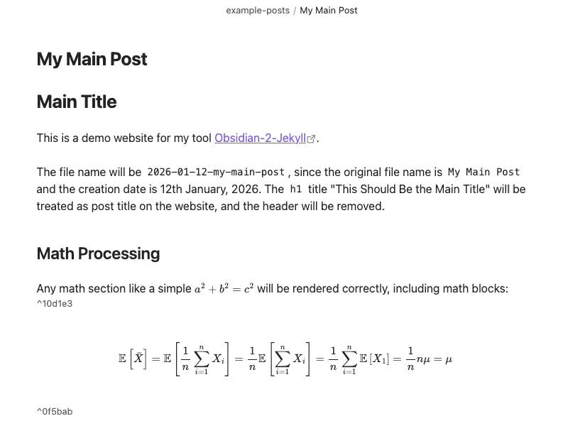
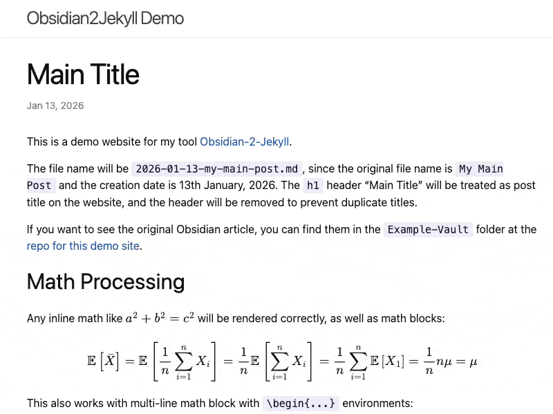

<p align="center">
  
</p>

<h1 align="center">Intaglio</h1>

<p align="center">
  A theme-agnostic tool that makes your Obsidian articles Jekyll-ready.
</p>

<p align="center">
  <a href="https://github.com/kckhchen/intaglio/actions/workflows/ci.yml"></a>
  <a href="https://github.com/kckhchen/intaglio/releases"></a>
  
  <a href="https://opensource.org/licenses/MIT"></a>
</p>

---

Intaglio scans your Obsidian vault, converts the notes you've marked as shared
into Jekyll-compatible posts, and writes them to your site — so your vault stays
clean Markdown while Jekyll gets the flavour it expects.

It runs as a CLI, or as a GitHub Action that opens a pull request against your
site repository on every push.

## Features

- Auto-generates all the essentials for the frontmatter.
- Converts your `h1` header to your post title.
- Copies used images to Jekyll assets folder and updates `![[img]]` links along with alt texts and width settings.
- Converts `[[Wikilinks]]` to standard Markdown links and links posts properly, including URLs and internal links.
- `$Math$` / `Code` / `> [!Callout]` / `[[#^Block Link]]` support.
- Syncs to your vault; removed posts and stale images get removed from your Jekyll site too.
- Your original Obsidian article remains intact, the way you want it to be.

## Live Demo

|                                      Original Obsidian Article                                       |                                     Processed Jekyll Site                                      |
| :--------------------------------------------------------------------------------------------------: | :--------------------------------------------------------------------------------------------: |
|  |  |

  <div align="center">
    <p><a href="https://kckhchen.com/obsidian-2-jekyll-demo/my-main-post/"><b>Read the Demo Blog Post</b></a></p>
  </div>

## Quick Start

### Prerequisites

- Python 3.10+
- Install dependencies with this command:

```bash
pip install -r requirements.txt
```

### Run the Tool

#### 1. Clone this repo

```bash
git clone https://github.com/kckhchen/intaglio.git
cd intaglio
```

#### 2. Configure your paths

Create a `.env` in the project root. It is git-ignored, so your
personal paths stay out of version control and `git pull` will never conflict.

```bash
cp .env.example .env
```

Then edit `.env` to set up paths to your vault and Jekyll site:

```bash
# .env
VAULT_DIR="/path/to/obsidian/vault"  # Path to Your Vault Folder
JEKYLL_DIR="/path/to/jekyll/site"  # Path to Your Jekyll Folder
```

#### 3. Setup Your Posts

Add `share: true` to your post's frontmatter ([Obsidian Properties](https://help.obsidian.md/properties)). You can use a [checkbox](https://help.obsidian.md/properties#Checkbox) or [plain text](https://help.obsidian.md/properties#Text). You can also add other settings (e.g. `date`, `slug`) to the frontmatter at this stage, although they are not strictly required.

Note that the tool adds `title`, `layout`, and `math` (based on settings) to the frontmatter for you, and grabs the creation date of your post as the `date` if you do not set one, so you don't have to configure these unless you wish to override the settings.

```markdown
---
share: true
---

# My Post Title
```

Only posts with `share: true` will be processed.

> [!TIP]
> It is still strongly recommended that you set `date` in the frontmatter manually to prevent unexpected updates, since the creation date of a file can potentially change due to file system operations.

#### 4. Run the command

```bash
# Process new posts
python3 main.py

# Process posts and clean up deleted posts
python3 main.py --update

# Process only one post (use only the post name, not the relative path)
python3 main.py --only "My Post.md"
```

> [!note]
> **A Note on Styling**: The first time you run the tool, it will create `_includes/obsidian-callouts.html`. This file handles the icons and colors for your callouts. Feel free to customize it.

### Actions (Optional)

This tool also comes with an `action.yml` for automating the converting process, as long as your vault (posts) and your Jekyll site are pushed and synced to GitHub repos. Once this is setup, your workflow becomes as simple as **"write, commit, push,"** and Actions will take care of the rest and send a PR to your Jekyll site with all the formatted posts. Follow the steps below:

#### 1. Set Up Repo Token

Generate a fine-grained token for your Jekyll site and set repository permissions to **Contents: Read and write** and **Pull Requests: Read and write**. Copy the token and paste to your repository secrets in your vault repo, naming it `BLOG_PUSH_TOKEN`.

#### 2. Create `.yml`

Create a `publish.yml` file under `.github/workflows` and paste the following snippet:

```yaml
name: Publish
on:
  push:
    branches: [main]
  workflow_dispatch:

jobs:
  publish:
    runs-on: ubuntu-latest
    steps:
      - uses: kckhchen/intaglio@v1
        with:
          jekyll-repo: username/jekyll-repo
          token: ${{ secrets.BLOG_PUSH_TOKEN }}
```

Or, if you want to sync the vault and remove stale posts and images:

```yaml
name: Publish
on:
  push:
    branches: [main]
  workflow_dispatch:

jobs:
  publish:
    runs-on: ubuntu-latest
    steps:
      - uses: kckhchen/intaglio@v1
        with:
          jekyll-repo: username/jekyll-repo
          token: ${{ secrets.BLOG_PUSH_TOKEN }}
          args: --update --force --yes
```

(For more information about flags, check out [GUIDE.md](./assets/docs/GUIDE.md).)

A few things to note before proceeding with this workflow:

1. It **does not** implement incremental builds. Incremental builds rely on file modification time, which refreshes on push. In other words, it effectively uses the `--force` flag every time it runs. This, however, should not make a huge impact on efficiency.
2. **Dates are mandatory**. As modification time becomes unreliable, it enforces explicit dates in the frontmatter. Failure to comply with this will trigger a delivery stopper.
3. **Cleanup automatically proceeds**. Without a CLI to prompt for confirmation, `--cleanup` and `--update` rely on the `--yes` flag to automatically proceed. To address this challenge, you can set a `max-deletions` (default to 10) limit that when reached, the process will send a warning. You can decide whether to merge the PR.
4. **Your vault and Jekyll site must be separate repositories.** The action checks out both into the runner workspace, and a single checkout cannot serve as both source and destination.
5. For full configuration settings available, check out [action_config.md](./assets/docs/action_config.md)

## User Guide

You can find the full User Guide and Advanced Settings in [GUIDE.md](./assets/docs/GUIDE.md).

## Contributing

This project is actively maintained and frequently updated. If you'd like to contribute, you can submit issues or fork this repository.

## Testing

This project uses `pytest` for testing. The tests are in the `tests` folder. To run the tests locally, follow these steps:

1. Install Dependencies

```bash
pip install -r requirements-dev.txt
```

1. Run the Test Suite
   To run all tests:

```bash
pytest
# or pytest --spec for spec reviews
```

To run a specific test file:

```bash
pytest tests/test_process_images.py
```

## Heads-Up

The test suite covers the conversion pipeline end to end across Linux and macOS on Python 3.10 and 3.13, and every post on my [personal blog](https://kckhchen.com/blog/) (in Mandarin Chinese) is generated by this tool. That said, Jekyll themes vary widely — if something renders oddly on your site, please open an issue.

Neither your original Obsidian notes nor hand-authored posts on your Jekyll site are ever touched: cleanup only removes files carrying the tool's own `generator: intaglio` frontmatter marker.
