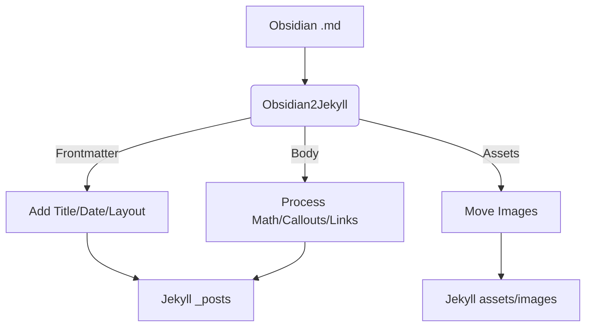

# User Guide

## Table of Contents
1. [Writing Guidelines](#writing-guidelines)
2. [Advanced Configurations](#advanced-configurations)
3. [How it Works](#what-this-tool-does)
    - [Frontmatter](#1-adds-title-and-layout-to-frontmatter)
    - [Dates & Renaming](#2-prepends-dates-before-file-names)
    - [Images](#3-copies-associated-images-to-a-dedicated-folder-and-updates-embedded-image-links)
    - [Internal Links](#4-updates-internal-links)
    - [Math](#5-process-inline-math)
    - [Callouts](#6-supports-callouts)

## Writing Guidelines

Just write normally! You don't need to manually configure the frontmatter (although you do need one and add `share: true`). The tool grabs your `h1` as the `title`, grabs the creation date as the `date`, and adds `layout` to your frontmatter.

If you wish, you can add additional settings or override the default in the frontmatter. Your configurations such as `title`, `date`, `slug`, or `permalink` will not be overridden by this tool.

## Advanced Configurations

### Command Line Arguments

You can clean up removed or outdated posts and images that are no longer referenced by any posts with the `--cleanup` flag:

```
python3 main.py --cleanup
```

This will not process new posts for you. If you wish to process new posts and clean up stale posts, please use `--update`.

You can also start a dry run first:

```
python3 main.py --dry
```

The default layout is `post`. You can change it with the `--layout` flag:

```
python3 main.py --layout YOUR_LAYOUT
```

Alternatively, add the layout in the frontmatter and the tool will respect the configuration.

The tool uses the modification date to decide whether to process a post. If you would like to force processing a post, you can use the `--force` flag. This is useful when you modify the scripts and what all posts to be updated.

```
python3 main.py --force
```

### Environmental Variables

| Variable              | Description                             | Default                      |
| --------------------- | ------------------------------------------- | ---------------------------- |
| `MATH_RENDERING_MODE` | `metadata` adds `math: true` to frontmatter; `inject_cdn` injects MathJax CDN at the end of post | `inject_cdn`           |
| `PREVENT_DOUBLE_BASEURL` | `True` to prevent double baseurl problem in Jekyll >= 4.0. [See Why](#4-updates-internal-links) | `False`           |

> [!NOTE]
> You can also create a `config_local.py` file to store you configurations. Those configurations will be prioritized.

### Frontmatters

All configurations manually added in the frontmatter will not be overridden by this tool.

To un-publish a post, simply toggle `share: false` or completely remove `share` in the frontmatter and run `--cleanup` or `--update`.

## What This Tool Does

The tool automatically does the following things to your posts:

### 1. Adds `title` and `layout` to Frontmatter

The tool automatically adds `layout: post` (or any layout format of your choice) to signal Jekyll which layout to use. It will also looks for the first `h1`, treats it as the title, and sets the `title` accordingly in the frontmatter, after which it will remove the `h1` to prevent duplicate titles. This allows you to use `h1` as you normally would.

If no `h1` is present, `title` won't be added and Jekyll will generate a title based on the file name. You can also manually add `title` to the frontmatter.

### 2. Prepends Dates Before File Names

If you have set `date` in the frontmatter, the tool will respect it and prepend the date to the (slugged) file name. If no `date` is given, the tool will prepend the **creation date** (or modification date, when creation dates are not available for some OS) to the file name to meet Jekyll's requirements.

If the file already has `yyyy-mm-dd` prepended to the file name, it will be removed, and the new date will be prepended (if you'd like to specify the date, please add it in the frontmatter).

For example, a `.md` file named `My New Note!.md` will be renamed to `yyyy-mm-dd-my-new-note.md`.

> [!note]
> It is recommended that you still manually add dates in the frontmatter since the creation date of a post can change due to several reasons, e.g. copying, cloning, etc.

### 3. Copies Associated Images to a Dedicated Folder And Updates Embedded Image Links

Embedded images `![[img.png|width]]` or ``, given that the actual images exist somewhere in the vault, will be transformed to `{: width="width" }`. If no width is given, only the image link is returned.

Also, all images associated with any of the processed posts will be copied to the dedicated image folder, while other irrelevant images will not be copied. This keeps your destination folder clean and tidy. Stale images will be cleaned up by `--cleanup` and `--update`, if the associated post is unpublished and no other posts are using the image.

If the image cannot be found in the vault, the embed link will be removed and a warning will be raised.

### 4. Updates Internal Links

The tool looks for `[[another post|displayed text]]` or `[displayed text](another post)` and changes them to Markdown links `[displayed-text](path/to/post)`.

It works with links to other posts `[[another-post]]`, header links `[[#some-h2-title]]`, block/section links `[[#^link-to-block]]`, and headers and blocks from other posts `[[another-post#some-h3-title]]`.

If the linked post does not exist (or is not published), the link will be transformed to plain text and a warning will be raised.

> [!NOTE]
> Section and block links are automatically prepended with a `secid` (e.g., `#^1e2t3` becomes `#secid1e2t3`) to ensure compatibility with HTML standards, which do not allow id's to start with a number. Don't worry if the id's don't look the same as in the original post.

> [!NOTE]
> The tool transforms wikilinks into [Jekyll Liquids](https://jekyllrb.com/docs/liquid/) `[display text]({{ site.baseurl }})`. For Jekyll version 3.x the `{{ site.baseurl }}` is necessary if you use a baseurl. However, in Jekyll >= 4.0 the `` Liquid adds base urls natively. Please set `PREVENT_DOUBLE_BASEURL` to `False` to prevent excessive addition of base urls.


### 5. Process Inline Math

The tool will look for inline math `$...$` and swap it into `\(...\)` so that most $\LaTeX$ math renderers will render it correctly. Math blocks `$$...$$` will be left as-is.

If the post contains math (be it inline math or math blocks), the tool will do one of the following things, depending on your configuration.

- ##### If `MATH_RENDERING_MODE = "metadata"`

The tool will add `math: true` to the frontmatter. If the Jekyll theme you use supports math modes then the math will be rendered by whatever renderer the theme chooses.

- ##### If `MATH_RENDERING_MODE = "inject_cdn"`

The tool will automatically inject a [MathJax](https://www.mathjax.org/) script at the bottom of the post so that the browser will be able to render the math, even if your theme doesn't.

Generally, if your Jekyll theme supports math mode then `metadata` should be preferred. Only use `inject_cdn` when the theme does not support math rendering.

> [!NOTE]
> If you wish to use the dollar sign `$` normally outside code blocks, please escape it with a backslash so that the tool won't treat it as math blocks.

### 6. Supports Callouts

Obsidian callouts such as `> [!INFO]` or `> [!warning]` (case-insensitive) will be parsed and transformed into html elements. If callouts are used in a post, the tool will inject ``, [Lucide's](https://lucide.dev/) CDN (Obsidian's original icon source), and a small icon-generating script `lucide.createIcons(...)` at the bottom of the post. The `obsidian-callouts.html` file will be saved to your root folder, inside the `_includes` folder, meeting Jekyll's requirement.

It supports every callout type, including their alias, specified on the [Obsidian callout site](https://help.obsidian.md/callouts). If a callout type is not in the list, a grey-ish default callout block will be assigned.


## Workflow

